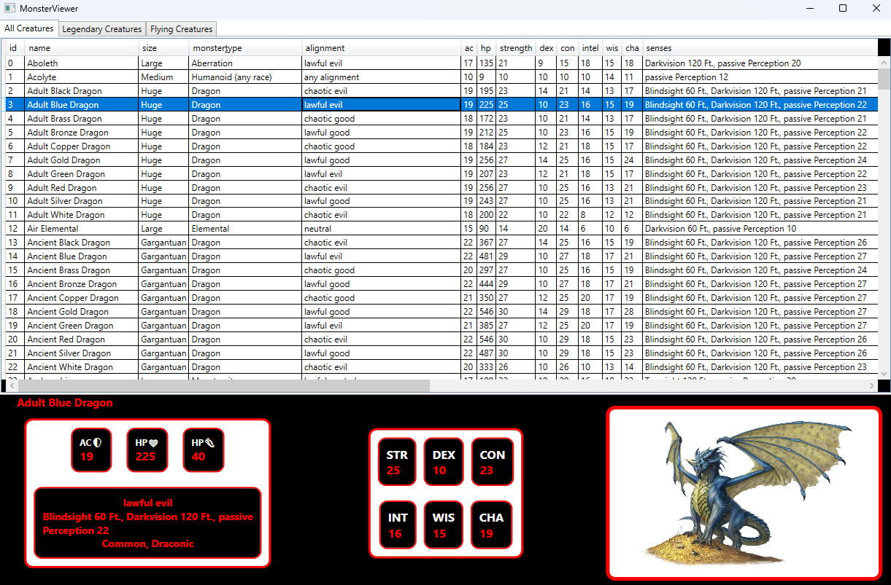

# ADO.NET-disconnected-1---MoreMonsters

<div style="display: flex; align-items: center; max-width: 800px; border: 2px solid #333; border-radius: 12px; padding: 16px; background-color: #222; margin: 20px auto;">
    
    <div style="flex: 1;color:white">
        <p>Het E-sport team van de hogeschool PXL is wanhopig om hun speedrun in **PXL Quest: Dungeon Dash** te verbeteren. Gelukkig hebben ze al gegevens verzameld over de monsters in het spel. Help met de visualisatie van de data, zodat het team efficiënt een speedrun af kan leggen doorheen de dungeon. </p>
    </div>
</div>

In MonsterData staan reeds enkele methode, maar hun invulling ontbreekt nog.

**Doelstelling**: Je gaat een csv-bestand uitlezen, nutteloze data wegfilteren en bestaande waardes verrijken met behulp van logica. Uiteindelijk visualiseer je de nieuwe `DataTable` in een **WPF** applicatie.

# 1. CSV naar DataTable
In het project is een CSV bestand voorzien door het E-sport team, genaamd *cleaned_monsters_complete.csv*. Hierin vind je alle gegevens terug die geïmporteerd moet worden. Hieronder volgt de representatie van de data in het bestand:

Maak een `DataTable` genaamd *_monsterDataTable_* op basis van de volgende kolommen:
```
id;name;size;monster_type;alignment;ac;hp;strength;str_mod;dex;dex_mod;con;con_mod;intel;int_mod;wis;wis_mod;cha;cha_mod;senses;languages;cr;str_save;dex_save;con_save;int_save;wis_save;cha_save;speed;swim;fly;climb;burrow;number_legendary_actions;history;perception;stealth;persuasion;insight;deception;arcana;religion;acrobatics;athletics;intimidation;image_source;image_name
```

Zoals je hierboven kan zien is dit bestand zeer uitgebreid. Lees het bestand uit en sla het op in een `DataTable`. Schrijf je oplossing hiervoor in `CreateMonsterDataTable()`.

# 2. DataTable filteren

Verwijder kolommen uit de DataTable tot je de volgende waardes behoudt.

```
id;name;size;monster_type;alignment;ac;hp;strength;dex;con;intel;wis;cha;senses;languages;cr;speed;image_source;image_name 
```
Zorg er verder voor dat je gepaste datatypes gebruikt voor elke kolom.
*Let op:* de kolom "cr" bevat waardes die kleiner zijn dan 1, zoals 0.25 of 0.5. Deze waardes zijn echter opgeslagen als breuken: 1/4 en 1/2. Zorg er voor dat **al** deze breuken correct worden opgeslagen als een numerieke waarde.

Breid je oplossing van 1. CSV naar DataTable in `CreateMonsterDataTable()` verder uit.

# 3. DataTable verrijken
Naast het filteren van bepaalde kolommen ga je ook sommige kolommen aanpassen: `number_legendary_actions` en `fly`. Verander de naam en waardes van de kolom als volgt.
1. flying - `bool`: Deze kolom is true of false afhankelijk van of het monster een waarde heeft die > 0 in de fly kolom.
2. legendary - `bool`: Deze kolom is true of false afhankelijk van of het monster een waarde heeft die > 0 in de number_legendary_actions kolom.

Werk je oplossing uit in `CreateLegendaryMonsterDataTable()` en `CreateFlyingMonsterDataTable()`.

# 4. DataGrid koppelen 
Nu je de monsterDataTable hebt opgebouwd en verrijkt, ga je deze gegevens visualiseren in je WPF applicatie.

### Nieuwe DataTables
Filter data op basis van de nieuwe kolommen. Voeg twee DataTable-objecten toe in MonsterData:

- _legendaryDataTable: bevat enkel de monsters waarbij de legendary-kolom true is

- _flyingDataTable: bevat enkel de monsters waarbij de flying-kolom true is

Je maakt deze tables aan door te filteren op de respectievelijke booleaanse kolommen.

### Koppeling met DataGrid
Tot slot koppel je de drie DataTables elk aan hun respectievelijk DataGrid. Je kan de DataGrid's terugvinden in de XAML van MainWindow. Dit doe je in het **Loaded** event van MainWindow.

# 5. Monster Selectie



Laat bij selectie van een monster de afbeelding en de gegevens van het monster in het statistieken gedeelte zien. Zorg er voor dat deze selectie werkt in al de drie DataGrid's.

Inspecteer de XAML en ontdek welke tekstvelenden allemaal ingevuld kunnen worden op basis van de geselecteerde rij. Indien de rij geen image source heeft, dan zet je de Visibility van de afbeelding op hidden. Anders, toon je de afbeelding.

</br>
<div style="font-size:24px">
 Veel succes!
</div>